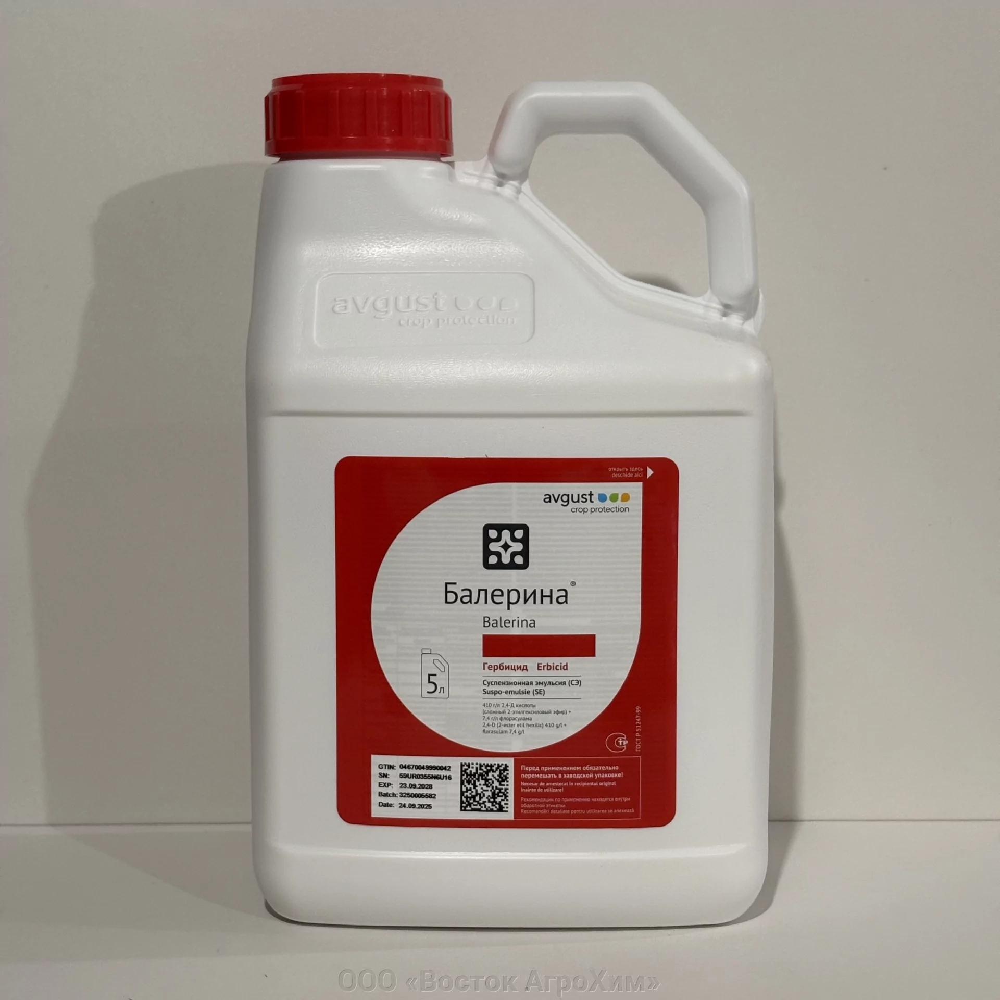
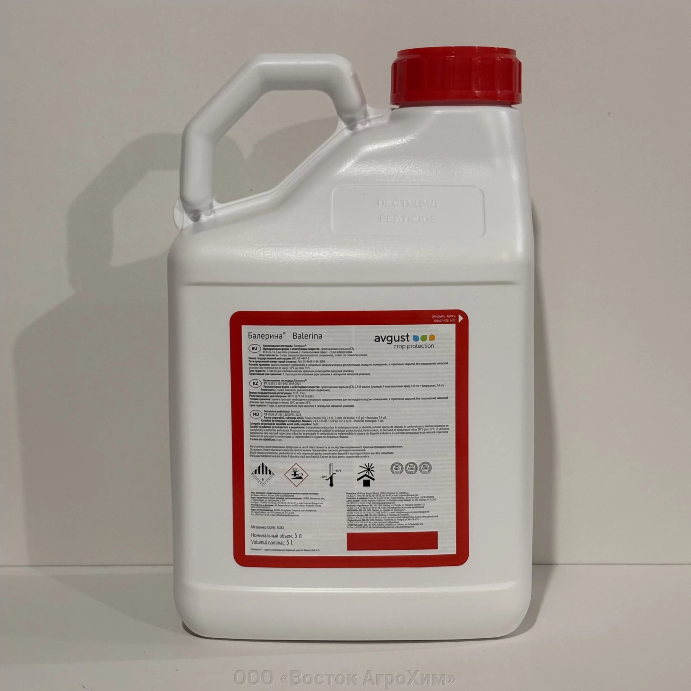

# Delta v4 — Карточка препарата (Балерина, СЭ)

**Контекст:** правки к третьей итерации `Product_card_balerina.dc.html` (v3 получена 11.08.2026).
**База:** `product-card-structure-v1.md` v1.2 (коммит d412725).
**Дата постановки:** 11.08.2026

---

## Что оставляем как есть

Третья итерация принята — все 5 правок delta v3 отработаны. Не трогаем:
- Цену 812 ₽/л, бейдж «Только оптом», бейдж «Доставка ТК по РФ»
- Аккордеон 6A (приготовление рабочего раствора)
- Аккордеон 6B (хранение и упаковка: канистры 5 и 10 л, 4 года, запрет замерзания)
- Аккордеон 6C (первая помощь полностью, телефон кликабелен)
- Аккордеоны 6D, 6E (транспортировка, охрана среды)
- Блок «Как работает препарат» отдельным H2
- Всё остальное из v1–v3

---

## 2 правки в этой итерации

### 1. Галерея — убрать слоты 2–5, оставить один слот с переключателем двух реальных фото

**Текущее состояние:** в Hero-зоне карточки 5 слотов изображений:
- Слот 1: главный (квадрат 1:1, плейсхолдер)
- Слоты 2–5: «канистра 5 л», «этикетка», «тара 5 л», «поле»

**Решение (ДМ28, принято 11.08.2026):** 1 слот с переключателем двух фото — лицевая и тыльная сторона упаковки. Фото со старого сайта vostok-agrohim.ru, с ватермаркой «ООО Восток АгроХим», загружены в репо.

**Что делать:**

Удалить слоты 2–5 полностью.

В слоте 1 реализовать переключатель двух фото:

```html
<!-- Главный слот — два фото с переключением -->
<div style="position:relative; aspect-ratio:1/1; background:#F8F4E9; border-radius:4px; overflow:hidden;">
  <!-- Фото 1 — лицевая сторона (активное по умолчанию) -->
  
  <!-- Фото 2 — тыльная сторона (скрыто) -->
  
  <!-- Переключатель -->
  <div style="position:absolute; bottom:8px; left:50%; transform:translateX(-50%); display:flex; gap:6px;">
    <button
      id="btn-front"
      onclick="showImg('front')"
      style="width:8px; height:8px; border-radius:50%; background:#26543E; border:none; cursor:pointer; padding:0;"
      aria-label="Лицевая сторона"
    ></button>
    <button
      id="btn-back"
      onclick="showImg('back')"
      style="width:8px; height:8px; border-radius:50%; background:rgba(38,84,62,0.25); border:none; cursor:pointer; padding:0;"
      aria-label="Тыльная сторона"
    ></button>
  </div>
</div>

<script>
function showImg(side) {
  document.getElementById('img-front').style.display = side === 'front' ? '' : 'none';
  document.getElementById('img-back').style.display  = side === 'back'  ? '' : 'none';
  document.getElementById('btn-front').style.background = side === 'front' ? '#26543E' : 'rgba(38,84,62,0.25)';
  document.getElementById('btn-back').style.background  = side === 'back'  ? '#26543E' : 'rgba(38,84,62,0.25)';
}
</script>
```

- Подпись-плейсхолдер убрать.
- Контейнер слота оставить (фон `#F8F4E9`, border-radius, соотношение 1:1).

---

### 2. Убрать неиспользуемые переменные галереи из data section

Удалить из data section все переменные, относящиеся к слотам 2–5. Слот 1 оставить.

---

## Ожидаемый результат

Обновлённая версия `Product_card_balerina.dc.html` (v4):
- Один слот с переключателем двух фото (лицо/тыл канистры) — собственные фото с ватермаркой «ООО Восток АгроХим»
- Карточка полностью наполнена реальным контентом и готова к приёмке клиентом
- Временных допущений по фото нет

---

## Ссылки

- Третья итерация: `Product_card_balerina.dc.html` v3 (получена 11.08.2026 в zip-архиве)
- Фото в репо: `uploads/balerina-se-410-g-l-7-4-g-l_de9b50b1f03169c_1920x9000_1.webp` (лицо), `uploads/balerina-se-410-g-l-7-4-g-l_3fc7ff43e3072ed_1920x9000_1.webp` (тыл)
- Предыдущие промпты: v1 (a9c4547), v2-delta (1e1ae9d), v3-delta (6db53fc)
- Реестр решений: `00-management/decisions-registry.md` — ДМ28, ОВ31 (11.08.2026)
